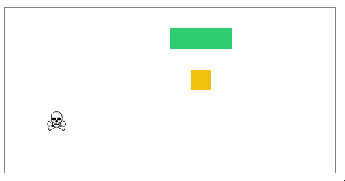

# Snake : 
Snake game developed by Thibaut Devigne.\
This game is not beautiful, not performant, code is not pretty but I've got a lot of fun developing it.\
It tooks me way too much time because I played instead of adding new feature.\
I hope you will enjoy it as much as I do. 

<p align="center">
  
</p>

## Usage
```shell
npm install
npm run start
```

## Features
* Collision detection with snake and with obstacle
* Customization of snake style
* Movement with arrows or ZQSD.
* Highscore Management
